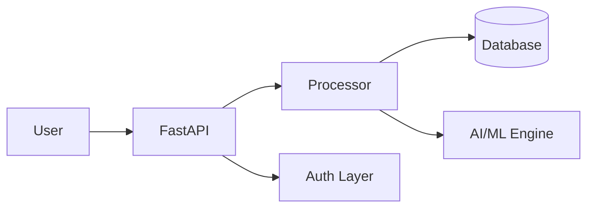

<div align="center">

# DDoS Detection Simulator

**Traffic simulation and real-time DDoS alert generation for security operations training**

[](https://python.org)
[](LICENSE)
[](SECURITY.md)

[](https://github.com/Raphasha27/kirov-dynamics)

**Built by [Koketso Raphasha](https://github.com/Raphasha27) — Practical AI for Africa**

</div>

## Overview

Educational DDoS detection simulation platform for SOC analysts and security students. Generates realistic network traffic patterns, simulates volumetric and application-layer attacks, and provides a detection dashboard with real-time alerting.

## Features

- **Traffic Simulation** — Realistic normal and attack traffic patterns
- **Attack Types** — Volumetric, SYN flood, HTTP flood, DNS amplification
- **Detection Engine** — ML-based anomaly detection algorithms
- **Real-time Dashboard** — Traffic visualization and alert console
- **Alert Generation** — Severity-based alerting with MITRE ATT&CK mapping
- **Historical Analysis** — PCAP export and post-event investigation


## Architecture



Microservices-based architecture with API Gateway, authentication layer, PostgreSQL persistence, and event-driven communication.

## Quick Start

```bash
git clone https://github.com/Raphasha27/DDOS-Detection-Simulator.git
cd DDOS-Detection-Simulator
pip install -r requirements.txt
python simulate.py
```

## ⚠️ Educational Use Only

This tool is designed for SOC training and educational purposes. It simulates DDoS traffic in isolated environments only.

## Ecosystem

| Project | Description |
|---------|-------------|
| [Network-Port-Scanner](https://github.com/Raphasha27/Network-Port-Scanner) | Multi-threaded network scanning and banner grabbing |
| [Insider-Threat-Detector](https://github.com/Raphasha27/Insider-Threat-Detector) | Behavioral analytics for insider threat detection |
| [Phishing-Awareness-Game](https://github.com/Raphasha27/Phishing-Awareness-Game) | Educational security awareness training |

## Product Ladder

```
GitHub (this repo)
    ↓
Portfolio → https://raphasha27.github.io/raphasha-dev-portfolio
    ↓
Contact → https://github.com/Raphasha27
```

## License

MIT — see [LICENSE](LICENSE)
